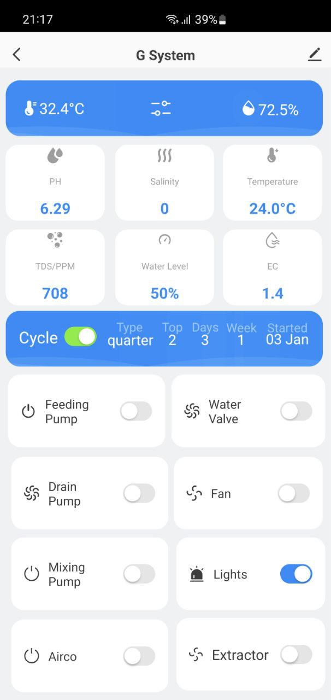
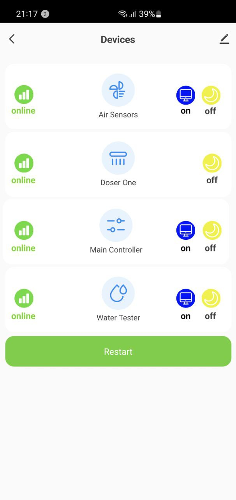
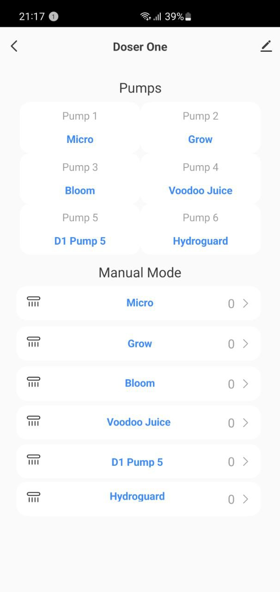
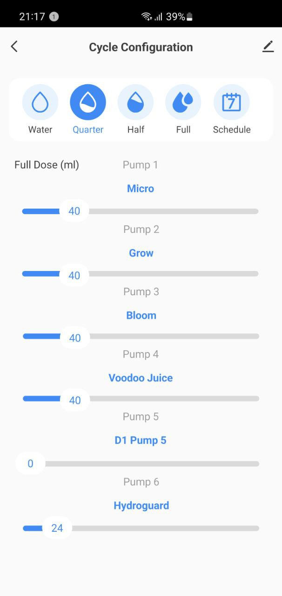
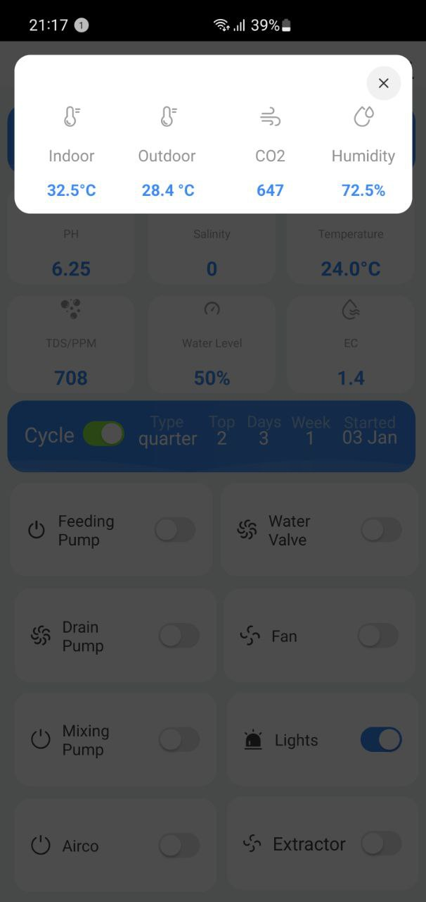

# Grow Room Python App

## Installation

1. clone the repository
```
git clone https://github.com/ground-creative/grow-room.git .

```
2. Populate options in config/config.py file
3. run setup.py
```
sudo python3 setup.py install
```

## Run App
```
python3 app.py
```

## Update 

1. Save the file config/config.py and repeat installation procedure
2. Replace config file

## Screenshots





